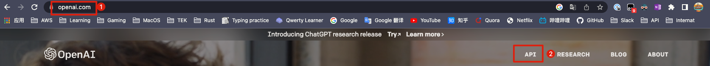
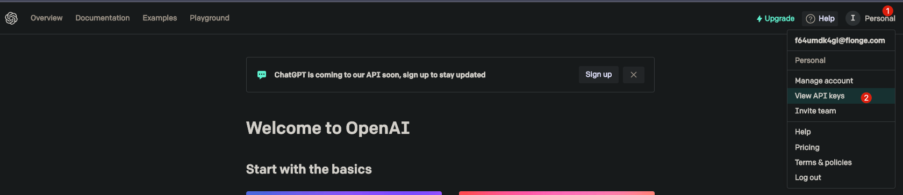
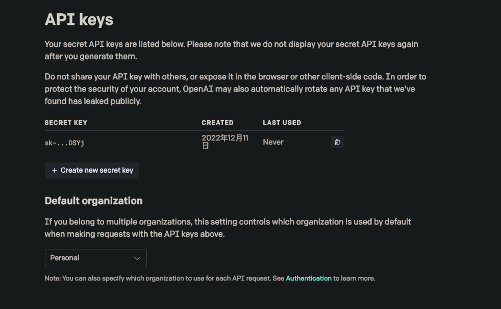
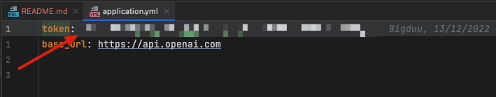

# 使用教程

--------

1. 打开OpenAI官网，点击[这里](https://openai.com/)进入官网, 点击API，点击[这里](https://openai.com/api/)进入API文档  
   
2. 登录 (账号密码可以再淘宝购买，搜OPENAI账号) (如果有梯子，可以直接登录[官网](https://chat.openai.com/chat))  
   
3. 点击Account profile，然后点击View API Keys  
   
4. 复制Secret Key，然后点击右上角的Edit，将Secret Key粘贴到Secret Key中，点击Save  
   
5. 填入API token  

6. 下载的二进制文件输入token [下载地址](https://github.com/bigduu/openai-cli/actions) 选择最新的构建,滑到做下面下载  

7. 输入问题 得到答案  

 
